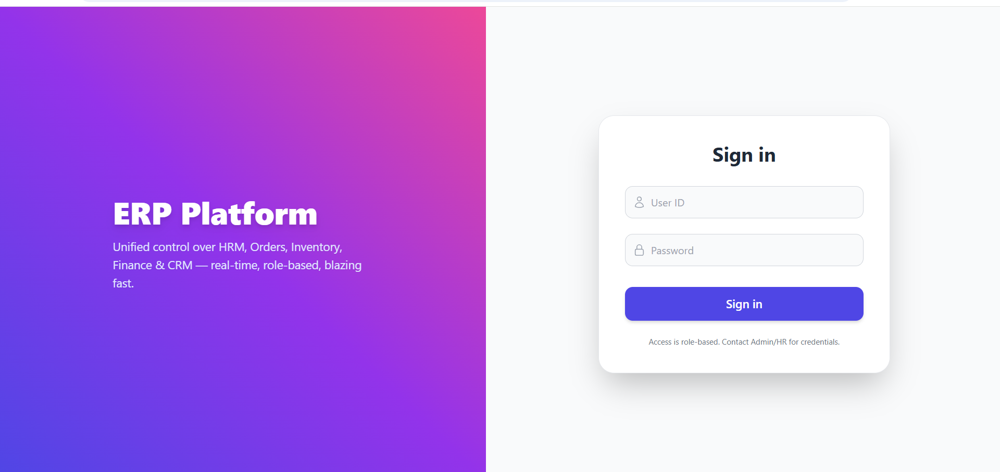
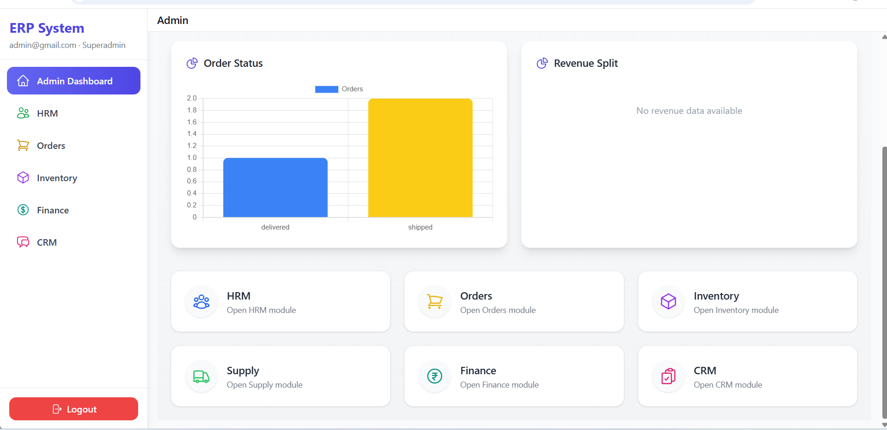
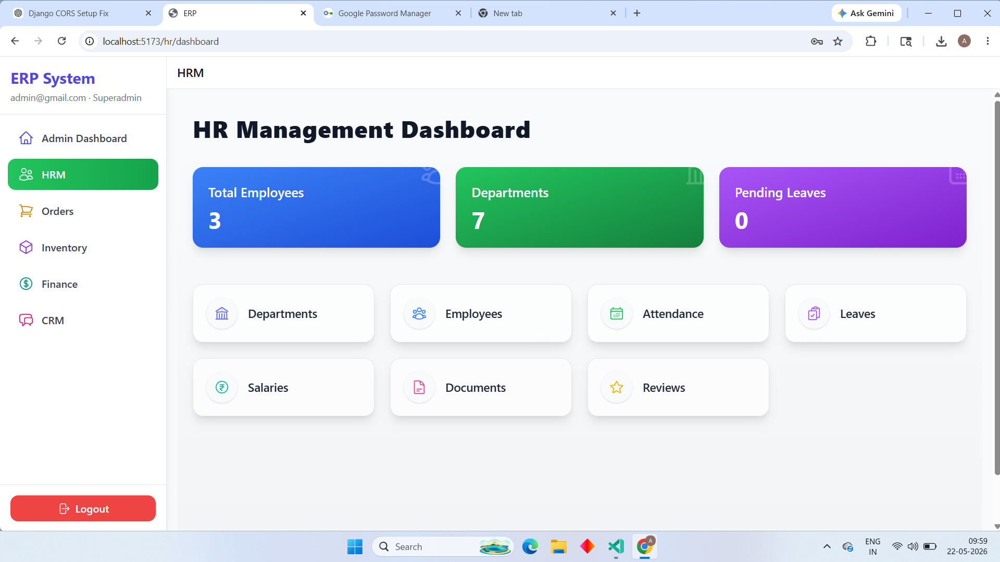
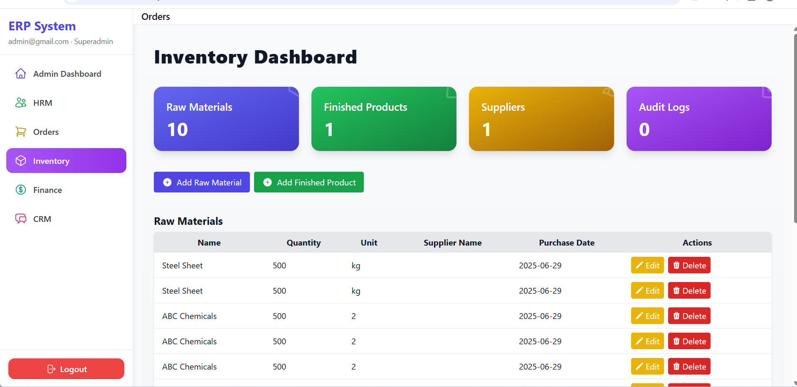
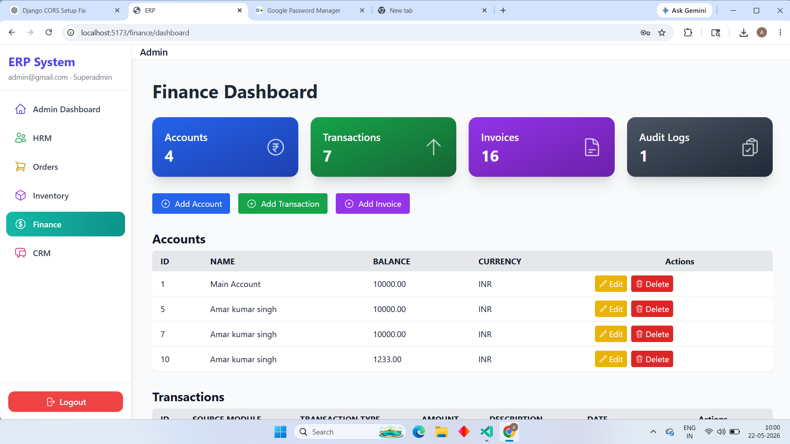
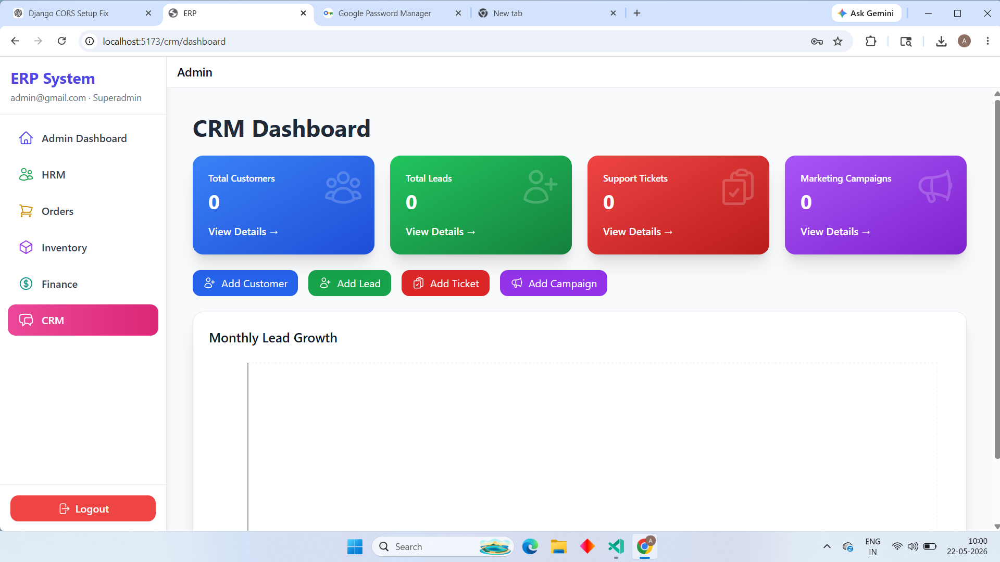

# 🚀 ERP Management System (Django + React)

A modern full-stack **Enterprise Resource Planning (ERP)** system built using **Django REST Framework** for the backend and **React.js + Tailwind CSS** for the frontend.

The platform is designed with a scalable modular architecture, role-based access control (RBAC), secure JWT authentication, and real-world enterprise workflows for business automation.

---

## 📌 Project Overview

The ERP system helps organizations manage and automate their core business operations through integrated modules including:

- 👨‍💼 Human Resource Management (HRM)
- 🤝 Customer Relationship Management (CRM)
- 📦 Inventory Management
- 🛒 Order Management
- 💰 Finance & Accounting
- 🚚 Supply Chain Management

The application supports multiple user roles with dedicated dashboards, permissions, and workflows.

---

## ✨ Key Features

- 🔐 JWT Authentication & Authorization
- 👥 Role-Based Access Control (RBAC)
- 📊 Modern Responsive Dashboards
- ⚡ Real-Time ERP Workflow Management
- 🧩 Modular & Scalable Architecture
- 📦 Inventory & Stock Tracking
- 💳 Finance & Accounting Automation
- 🧾 Order & Invoice Management
- 👨‍💼 HRM & Employee Management
- 🤝 CRM & Customer Tracking
- 🔄 API Integration Ready
- ☁️ Production Ready Backend Structure

---

# 🛠️ Tech Stack

## 🔹 Backend

- Python
- Django
- Django REST Framework (DRF)
- JWT Authentication
- Celery
- Redis
- SQLite (Development)
- PostgreSQL (Production Ready)

---

## 🔹 Frontend

- React.js
- React Router
- Tailwind CSS
- Axios
- Context API
- RBAC Authentication System

---

## 🔹 Tools & Platforms

- Git & GitHub
- Postman (API Testing)
- Docker Support
- VS Code

---

# 🧩 Modules Implemented

## ✅ Human Resource Management (HRM)

- Employee Management
- Departments
- Attendance Tracking
- Leave Management
- Payroll & Salary System
- Performance Reviews

---

## ✅ Customer Relationship Management (CRM)

- Customer Management
- Lead Tracking
- Interaction History
- CRM Analytics Dashboard

---

## ✅ Order Management

- Order Creation
- Order Processing
- Status Tracking
- Finance & Inventory Integration

---

## ✅ Inventory Management

- Product Management
- Stock Tracking
- Reorder Alerts
- Inventory Audit Logs

---

## ✅ Finance & Accounting

- Income & Expense Tracking
- Invoice Management
- Financial Reports
- Automated Transactions

---

## ✅ Supply Chain Management

- Supplier Management
- Procurement System
- Warehouse Tracking
- Logistics Management

---

# 👥 User Roles & Permissions

| Role | Access |
|------|--------|
| SuperAdmin | Full System Access |
| Manager | Orders, Inventory & Finance |
| HR Manager | HRM Module |
| Employee | Self-Service Dashboard |

---

# 🔄 System Workflow

```text
Authentication System
        ↓
Role-Based Dashboard
        ↓
ERP Module Access
        ↓
Business Operations Processing
        ↓
Database & API Integration
        ↓
Real-Time Analytics & Reports
```

---

# 📸 Screenshots

## 🔐 Login Page


---

## 📊 Admin Dashboard


---

## 👨‍💼 HRM Module


---

## 📦 Inventory Module


---

## 💰 Finance Module


---

## 🤝 CRM Module


---

# 📂 Project Structure

```text
ERP-SYSTEM/
│
├── Backend/
│   └── erp_backend/
│       ├── accounts/
│       ├── hrm/
│       ├── crm/
│       ├── inventory/
│       ├── orders/
│       ├── finance/
│       └── supply_chain/
│
├── Frontend/
│   └── erp-frontend/
│       ├── src/
│       │   ├── auth/
│       │   ├── components/
│       │   ├── modules/
│       │   ├── routes/
│       │   ├── services/
│       │   └── layouts/
│
└── README.md
```

---

# ⚙️ Installation & Setup

## 🔹 Backend Setup

```bash
cd Backend

python -m venv venv

venv\Scripts\activate

pip install -r requirements.txt

python manage.py migrate

python manage.py createsuperuser

python manage.py runserver
```

---

## 🔹 Frontend Setup

```bash
cd Frontend/erp-frontend

npm install

npm run dev
```

---

# 🔐 Environment Variables

Create `.env` files (not committed to GitHub).

## Frontend `.env`

```env
VITE_API_BASE_URL=http://127.0.0.1:8000/api
```

---

# 🚀 Future Enhancements

- 📊 Advanced Analytics Dashboard
- 🔔 Real-Time Notifications
- 📱 Mobile ERP Application
- 🌐 Multi-Tenant Support
- 📄 PDF & Excel Export
- ☁️ Cloud Deployment
- 🤖 AI-Powered ERP Insights
- 📈 Business Intelligence Reports

---

# 👨‍💻 Author

**Amar Kumar Singh**  
Final Year B.Tech CSE Student  
Full Stack & AI/ML Developer

---

# 📜 License

This project is licensed under the MIT License.

# 📸 Screenshots

## 🔐 Login Page


---

## 📊 Admin Dashboard


---

## 👨‍💼 HRM Module


---

## 📦 Inventory Module


---

## 💰 Finance Module


---

## 🤝 CRM Module

